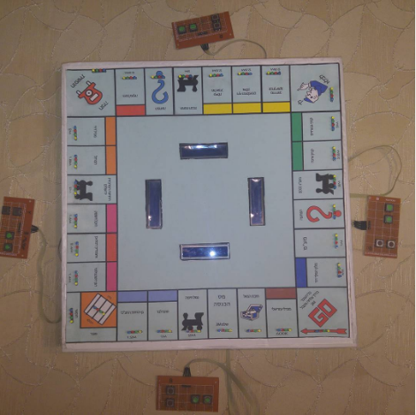

# ElectronicMonopoly
Final Project for Practical Electronics Engineering diploma.

With the help of my Project mentor Avner Barak.

We built this project using Altera, VHDL, Led`s, LCD`s and coustome joysticks.

